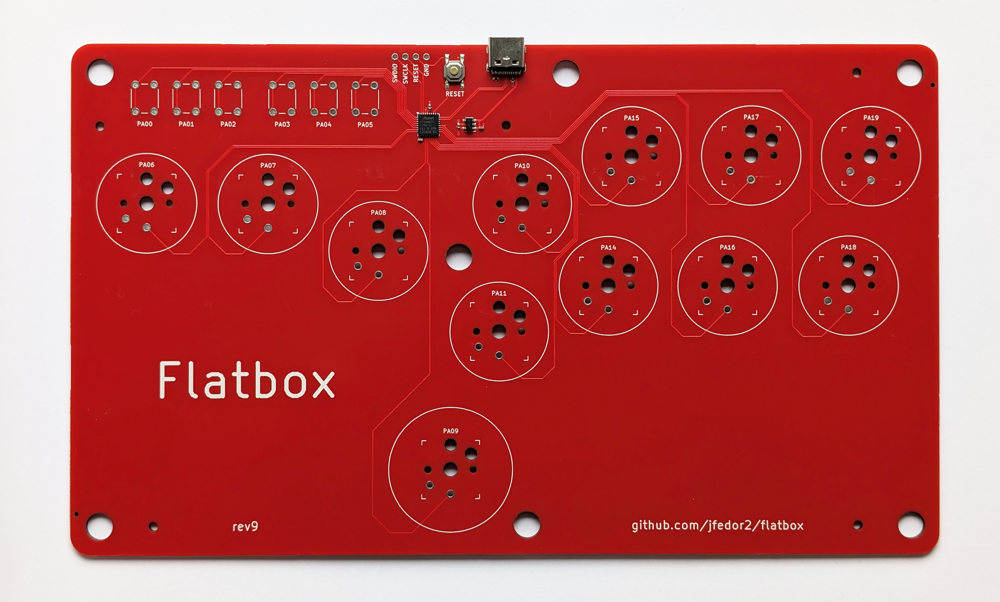
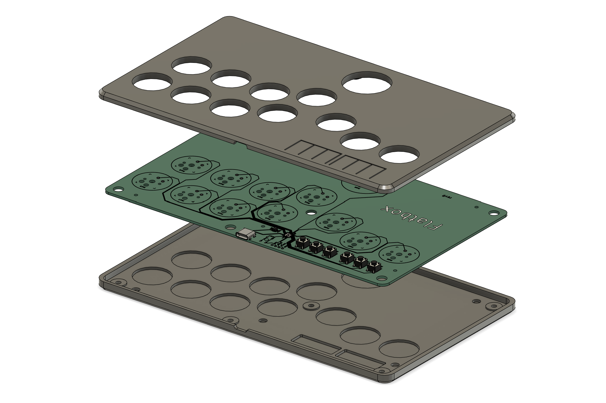

# Flatbox rev9

This is rev9 of the Flatbox. In this version the PCB includes the microcontroller (a SAMD21 chip) - everything is built in, you only have to add the switches (and flash the firmware).

There are two variants of the case, version A uses flaps for the option buttons, version B has holes so that you can use buttoncaps on the tact switches:

To make one you will need:

* [3D printed case parts](3d-printed-case) - top and bottom
* [the PCB](pcb)
* 12x Kailh low profile (choc v1) switches of your choice
* (optionally) 12x Kailh low profile hotswap sockets
* buttoncaps for the action buttons, either [3D printed](../3d-printed-buttoncaps) or (preferably) injection molded (make sure they're the correct size: 22.5mm and 28.5mm)
* for case variant A:
  * 6x 6x6x5mm tact switches
* for case variant B:
  * 6x 6x6x7mm tact switches
  * 6x silicone buttoncaps (like [these](https://www.aliexpress.com/item/32846395636.html) or search for "silicone button caps" on AliExpress; or you can use other caps as long as they fit, the hole diameter is 7.5mm)
* 7x M3x6 flat head (countersunk) screws
* 5x M2x4 screws to secure the PCB to the case
* some kind of rubber feet or non-slip padding for the bottom
* a soldering iron

I printed the case at 0.20mm layer height. The top part should be printed upside-down, the bottom part should be printed as-is. They don't require supports.

I used [JLCPCB](https://jlcpcb.com/) to make the PCB and assemble the SMD parts. The [included files](pcb) can be used with JLCPCB directly. If you want to use some other service, check the file formats that they expect. When ordering from JLCPCB, upload the Gerber zip, leave all the settings at default (you can choose the PCB color), then enable "PCB Assembly" and upload the BOM and CPL files in the next step. PCB thickness should be 1.6mm.

The PCB you get from JLCPCB will look like this:

The switches can be soldered in directly to the PCB or you can use hotswap sockets.

There are various ways that you can put firmware on the board and make it into a functional controller. Here's what I did. The relevant files are in the [binaries](binaries) folder.

1. Using an ST-Link V2 clone debug interface, put a UF2 bootloader on the board. Wire SWDIO, SWDCLK, RESET and GND lines between the ST-Link and the board and connect the board to a PC over USB for power. Then flash the bootloader with this command: 
`openocd -f openocd_stlink_samd21.cfg -c "init; program bootloader-flatbox_rev9-1d99238.bin verify reset; shutdown"`
2. Disconnect the ST-Link from the board.
3. Now when you connect the board to a PC, a USB drive named "FLATBOXREV9" should appear. Copy the [CircuitPython UF2](binaries/adafruit-circuitpython-flatbox_rev9-en_US-20250410-main-79e1642.uf2) file to that drive.
4. Now your board is running CircuitPython. When you connect it to a PC, a USB drive named "CIRCUITPY" should appear. Copy the files from the [firmware-circuitpython](../firmware-circuitpython) folder to that drive, then disconnect and reconnect the board. It should now show up as a game controller.

You can find the Flatbox-specific UF2 bootloader and CircuitPython modifications [here](https://github.com/jfedor2/uf2-samdx1) and [here](https://github.com/jfedor2/circuitpython). The openocd_stlink_samd21.cfg file is taken from [here](https://github.com/todbot/samd21-programming-notes).

If you ever need to get to the bootloader again to flash a different version of CircuitPython or some other UF2 file, press the RESET button twice quickly.

If you want to modify the case or the PCB, check out the files in the [extras](extras) folder.

PCB design licensed under [CC BY-SA 4.0](https://creativecommons.org/licenses/by-sa/4.0/).

PCB design uses the following libraries:

* [keyswitches.pretty](https://github.com/daprice/keyswitches.pretty) by [daprice](https://github.com/daprice) ([CC BY-SA 4.0](https://creativecommons.org/licenses/by-sa/4.0/))
* [Type-C.pretty](https://github.com/ai03-2725/Type-C.pretty) by [ai03-2725](https://github.com/ai03-2725)
